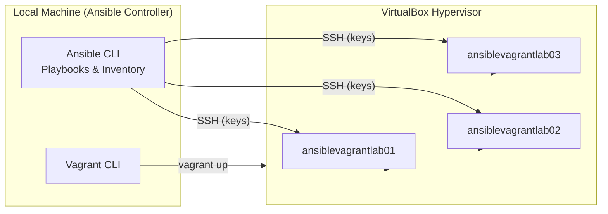

# Your Laptop is your New Cloud: Build a DevOps Lab Environment with Vagrant

### Introduction

As DevOps engineers, we constantly need test environments to experiment, validate automation, and practice configuration management. For a long time, I relied on free-tier cloud accounts to spin up virtual machines whenever I wanted to test Ansible playbooks.

While it works, the process is slow, repetitive, and often frustrating — creating accounts, managing credentials, provisioning instances, and cleaning everything up again.

Over time, I realized I was spending more effort setting up environments than actually learning and experimenting.

That’s when I switched to Vagrant.

With Vagrant, I can provision a complete multi-VM lab on my local machine in minutes. It’s fast, repeatable, and requires zero cloud setup. In this post, I’ll show you how to build a simple Vagrant-based lab that you can use to practice Ansible, networking, and automation — all on your laptop.


## Prerequisites

1. [Install Ansible](https://docs.ansible.com/projects/ansible/latest/installation_guide/intro_installation.html) - to run playbooks aganist your Vagrant VMs
2. [Install Vagrant](https://developer.hashicorp.com/vagrant/install) - to define and manage your lab environment
3. [Install Oracle VirtualBox](https://www.virtualbox.org/wiki/Downloads) - as the hypervisor provider for vagrant

## Building the Vagrant Lab Environment

### Environment Architecture

Vagrant provisions and manages the virtual machines through VirtualBox, while the local machine acts as the Ansible control node and connects to each VM over SSH to run automation playbooks.



### 1. Create the `Vagrantfile`

A `Vagrantfile` defines the layout and configuration of your lab environment. Create a file named `Vagrantfile` in your project directory with the following content

```ruby
Vagrant.configure("2") do |config|
  config.vm.box = "bento/ubuntu-22.04"

  #path to your local SSH key
  SSH_KEY = File.expand_path("./vagrantkey.pub")

  NODES = [
    {name: "ansiblevagrantlab01", ip: "192.168.58.101"},
    {name: "ansiblevagrantlab02", ip: "192.168.58.102"},
    {name: "ansiblevagrantlab03", ip: "192.168.58.103"},
  ]

  # Common provisioning for all nodes
  config.vm.provision "shell", privileged: true, inline: <<-SHELL
    # Create ansible user
    id ansible &>/dev/null || useradd -m -s /bin/bash ansible
    mkdir -p /home/ansible/.ssh
    chmod 700 /home/ansible/.ssh

    # Add ansible controller public key
    cat /vagrant/vagrantkey.pub >> /home/ansible/.ssh/authorized_keys
    chmod 600 /home/ansible/.ssh/authorized_keys
    chown -R ansible:ansible /home/ansible/.ssh

    # Enable passwordless sudo
    echo "ansible ALL=(ALL) NOPASSWD:ALL" > /etc/sudoers.d/ansible
    chmod 400 /etc/sudoers.d/ansible

  SHELL

  # Dynamic node creation
  
  NODES.each do |node|
    config.vm.define node[:name] do |vm|
      vm.vm.hostname = node[:name]
      vm.vm.network "private_network", ip: node[:ip]

      vm.vm.provider :virtbox do |vb|
        vb.memory = 1024
        vb.cpus = 1
      end
    end
  end

end

```

In the above `Vagrantfile`: 
- We used the `bento/ubuntu-22.04` base box
- We define multiple VMs with static IPs
- We prepare an `ansible` user and passwordless SSH access via a public key


### 2. Generate the SSH key pair
We need a key-pair to allow passwordless SSH from your local machine to the Vagrant VMs

To generate a SSH key-pair run the below command in the project's root directory.

```bash

$ ssh-keygen -t ed25519 -f ./vagrantkey

Generating public/private ed25519 key pair.
Enter passphrase for "./vagrantkey" (empty for no passphrase): 
Enter same passphrase again: 
Your identification has been saved in ./vagrantkey
Your public key has been saved in ./vagrantkey.pub
The key fingerprint is:
SHA256:/EXFBw7J7eKDuOp3YXXJg2Xp9z1SKL6Vz4s9m9Jt1/M eswarmaganti@Eswars-MacBook-Air.local
The key's randomart image is:
+--[ED25519 256]--+
|           ..+oo |
|            o+* .|
|            .Boo |
|       .   o+.B..|
|        S..+ooooo|
|        ..+oo+ .o|
|         o..o.= +|
|        o .. .o**|
|     .oo .   ..*E|
+----[SHA256]-----+

```
This Generates 
- `vagrantkey` private key
- `vagrantkey.pub` public key

Verify by listing the files in your project directory, you should see the files being generated.

```bash
$ ls -l
total 32
-rw-r--r--@ 1 eswarmaganti  staff  1242  3 Feb 05:53 Vagrantfile
-rw-------  1 eswarmaganti  staff   432  3 Feb 05:55 vagrantkey
-rw-r--r--  1 eswarmaganti  staff   119  3 Feb 05:55 vagrantkey.pub
```

### 3. Provision the Vagrant VMs
Now start the provisioning the VMs by running the below command

```bash
$ vagrant up

Bringing machine 'ansiblevagrantlab01' up with 'virtualbox' provider...
Bringing machine 'ansiblevagrantlab02' up with 'virtualbox' provider...
Bringing machine 'ansiblevagrantlab03' up with 'virtualbox' provider...
==> ansiblevagrantlab01: Importing base box 'bento/ubuntu-22.04'...
==> ansiblevagrantlab01: Matching MAC address for NAT networking...
==> ansiblevagrantlab01: Checking if box 'bento/ubuntu-22.04' version '202510.26.0' is up to date...
==> ansiblevagrantlab01: Setting the name of the VM: ubuntulab_ansiblevagrantlab01_1770079529437_97103
==> ansiblevagrantlab01: Clearing any previously set network interfaces...
==> ansiblevagrantlab01: Preparing network interfaces based on configuration...
    ansiblevagrantlab01: Adapter 1: nat
    ansiblevagrantlab01: Adapter 2: hostonly
==> ansiblevagrantlab01: Forwarding ports...
    ansiblevagrantlab01: 22 (guest) => 2222 (host) (adapter 1)
==> ansiblevagrantlab01: Booting VM...
==> ansiblevagrantlab01: Waiting for machine to boot. This may take a few minutes...
    ansiblevagrantlab01: SSH address: 127.0.0.1:2222
    ansiblevagrantlab01: SSH username: vagrant
    ansiblevagrantlab01: SSH auth method: private key
    ansiblevagrantlab01: Warning: Connection reset. Retrying...
    ansiblevagrantlab01: Warning: Remote connection disconnect. Retrying...
    ansiblevagrantlab01: 
    ansiblevagrantlab01: Vagrant insecure key detected. Vagrant will automatically replace
    ansiblevagrantlab01: this with a newly generated keypair for better security.
    ansiblevagrantlab01: 
    ansiblevagrantlab01: Inserting generated public key within guest...
    ansiblevagrantlab01: Removing insecure key from the guest if it's present...
    ansiblevagrantlab01: Key inserted! Disconnecting and reconnecting using new SSH key...
==> ansiblevagrantlab01: Machine booted and ready!
==> ansiblevagrantlab01: Checking for guest additions in VM...
==> ansiblevagrantlab01: Setting hostname...
==> ansiblevagrantlab01: Configuring and enabling network interfaces...
==> ansiblevagrantlab01: Mounting shared folders...
    ansiblevagrantlab01: /Users/eswarmaganti/Developer/Projects/Vagrant/ubuntulab => /vagrant
==> ansiblevagrantlab01: Running provisioner: shell...
    ansiblevagrantlab01: Running: inline script

[Output Trucated...]
```
The above command will 
  -  Download the base box if needed
  -  Create and boots each VM
  -  Runs the provisioning script defined in the Vagrantfile
  -  Makes the VMs ready for use

We can check the status of our Vagrnt VMs once the 
provisioning step completed successfully.

```bash
$ vagrant status
Current machine states:

ansiblevagrantlab01       running (virtualbox)
ansiblevagrantlab02       running (virtualbox)
ansiblevagrantlab03       running (virtualbox)

This environment represents multiple VMs. The VMs are all listed
above with their current state. For more information about a specific
VM, run `vagrant status NAME`.

$ vagrant status ansiblevagrantlab01
Current machine states:

ansiblevagrantlab01       running (virtualbox)

The VM is running. To stop this VM, you can run `vagrant halt` to
shut it down forcefully, or you can run `vagrant suspend` to simply
suspend the virtual machine. In either case, to restart it again,
simply run `vagrant up`.

```

### 4. Access the Lab VMs
By default we can directly login to Vagrnat VMs using the vagrant commadline from our local machine as shown below

```
$ vagrant ssh ansiblevagrantlab01
Welcome to Ubuntu 22.04.5 LTS (GNU/Linux 5.15.0-160-generic aarch64)

 * Documentation:  https://help.ubuntu.com
 * Management:     https://landscape.canonical.com
 * Support:        https://ubuntu.com/pro

 System information as of Tue Feb  3 01:13:36 AM UTC 2026

  System load:           0.0
  Usage of /:            18.4% of 29.82GB
  Memory usage:          5%
  Swap usage:            0%
  Processes:             97
  Users logged in:       0
  IPv4 address for eth0: 10.0.2.15
  IPv6 address for eth0: fd17:625c:f037:2:a00:27ff:fed9:fa93


This system is built by the Bento project by Chef Software
More information can be found at https://github.com/chef/bento

Use of this system is acceptance of the OS vendor EULA and License Agreements.

vagrant@ansiblevagrantlab01:~$ hostname
ansiblevagrantlab01
vagrant@ansiblevagrantlab01:~$ whoami
vagrant
vagrant@ansiblevagrantlab01:~$ cat /etc/os-release 
PRETTY_NAME="Ubuntu 22.04.5 LTS"
NAME="Ubuntu"
VERSION_ID="22.04"
VERSION="22.04.5 LTS (Jammy Jellyfish)"
VERSION_CODENAME=jammy
ID=ubuntu
ID_LIKE=debian
HOME_URL="https://www.ubuntu.com/"
SUPPORT_URL="https://help.ubuntu.com/"
BUG_REPORT_URL="https://bugs.launchpad.net/ubuntu/"
PRIVACY_POLICY_URL="https://www.ubuntu.com/legal/terms-and-policies/privacy-policy"
UBUNTU_CODENAME=jammy
```

To simplify the hostname resolution from your local machine (outside of Vagrant), you can add the entries to your `/etc/hosts` file


```bash
192.168.58.101 ansiblevagrantlab01
192.168.58.102 ansiblevagrantlab02
192.168.58.103 ansiblevagrantlab03
```
This will allow you to refer VMs directly by hostname instead of IP address

```bash
$ ping -c 5 ansiblevagrantlab01
PING ansiblevagrantlab01 (192.168.58.101): 56 data bytes
64 bytes from 192.168.58.101: icmp_seq=0 ttl=64 time=3.148 ms
64 bytes from 192.168.58.101: icmp_seq=1 ttl=64 time=0.914 ms
64 bytes from 192.168.58.101: icmp_seq=2 ttl=64 time=1.163 ms
64 bytes from 192.168.58.101: icmp_seq=3 ttl=64 time=0.912 ms
64 bytes from 192.168.58.101: icmp_seq=4 ttl=64 time=1.068 ms

--- ansiblevagrantlab01 ping statistics ---
5 packets transmitted, 5 packets received, 0.0% packet loss
round-trip min/avg/max/stddev = 0.912/1.441/3.148/0.859 ms
```

Test the SSH connectivity from local machine

```bash
$ ssh ansible@ansiblevagrantlab03 -i ./vagrantkey
Welcome to Ubuntu 22.04.5 LTS (GNU/Linux 5.15.0-160-generic aarch64)

 * Documentation:  https://help.ubuntu.com
 * Management:     https://landscape.canonical.com
 * Support:        https://ubuntu.com/pro

 System information as of Tue Feb  3 01:19:25 AM UTC 2026

  System load:           0.01
  Usage of /:            18.8% of 29.82GB
  Memory usage:          5%
  Swap usage:            0%
  Processes:             98
  Users logged in:       0
  IPv4 address for eth0: 10.0.2.15
  IPv6 address for eth0: fd17:625c:f037:2:a00:27ff:fed9:fa93


This system is built by the Bento project by Chef Software
More information can be found at https://github.com/chef/bento

Use of this system is acceptance of the OS vendor EULA and License Agreements.
$ whoami
ansible

$ hostname
ansiblevagrantlab03
```

### 5. Create an Ansible Inventory file

Create `inventory.yaml` with Vagrant VM details

```yaml
---
all:
  vars:
    ansible_user: ansible
    ansible_ssh_private_key_file: ./vagrantkey
    ansible_become: true
    ansible_become_method: sudo
    ansible_python_interpreter: "/usr/bin/python3"

  children:
    lab:
      hosts:
        ansiblevagrantlab01:
          ansible_host: 192.168.58.101
        ansiblevagrantlab02:
          ansible_host: 192.168.58.102
        ansiblevagrantlab03:
          ansible_host: 192.168.58.103
```

Now test the connectivity using ansible adhoc command `ping`

```bash
$ ansible -m ping -i inventory.yaml lab

ansiblevagrantlab03 | SUCCESS => {
    "changed": false,
    "ping": "pong"
}
ansiblevagrantlab01 | SUCCESS => {
    "changed": false,
    "ping": "pong"
}
ansiblevagrantlab02 | SUCCESS => {
    "changed": false,
    "ping": "pong"
}
```
> You should receive a pong from each VM, which confirms SSH connectivity and Ansible Setup

### 6. Run an Ansible Playbook
We will write a playbook `playbook.yaml` to install python and nginx web server and try to access the web page from our local machine.

```yaml
---
- name: Install Nginx Web Server
  hosts: all
  gather_facts: false
  become: true
  vars:
    packages:
      - nginx
      - python3
      - python3-apt
      - python3-pip
  tasks:
    - name: Install the nginx & Python packages
      ansible.builtin.apt:
        name: "{{ packages }}"
        state: present
        update_cache: yes

    - name: Start the Nginx Service
      ansible.builtin.service:
        name: nginx
        state: started
    
    - name: Check the Nginx Service Status
      ansible.builtin.service:
        name: nginx
      register: output
    
    - name: Log the service status
      ansible.builtin.debug:
        msg: "{{ output.status.ActiveState }}"
```

Now run the playbook aganist one target node `ansiblevagrantlab01` 

```shell
$ ansible-playbook playbook.yaml -i inventory.yaml --limit ansiblevagrantlab01

PLAY [Install Nginx Web Server] ***********************************************************************************

TASK [Install the nginx & Python packages] ************************************************************************
changed: [ansiblevagrantlab01]

TASK [Start the Nginx Service] ************************************************************************************
ok: [ansiblevagrantlab01]

TASK [Check the Nginx Service Status] *****************************************************************************
ok: [ansiblevagrantlab01]

TASK [Log the service status] *************************************************************************************
ok: [ansiblevagrantlab01] => {
    "msg": "active"
}

PLAY RECAP ********************************************************************************************************
ansiblevagrantlab01        : ok=4    changed=1    unreachable=0    failed=0    skipped=0    rescued=0    ignored=0   
```
Our playbook successfully executed and configured python and nginx packages.

Now we can access the nginx server using a curl or directly accessing the VM hostname in browser

```bash
$ curl --insecure http://ansiblevagrantlab01 
<!DOCTYPE html>
<html>
<head>
<title>Welcome to nginx!</title>
<style>
    body {
        width: 35em;
        margin: 0 auto;
        font-family: Tahoma, Verdana, Arial, sans-serif;
    }
</style>
</head>
<body>
<h1>Welcome to nginx!</h1>
<p>If you see this page, the nginx web server is successfully installed and
working. Further configuration is required.</p>

<p>For online documentation and support please refer to
<a href="http://nginx.org/">nginx.org</a>.<br/>
Commercial support is available at
<a href="http://nginx.com/">nginx.com</a>.</p>

<p><em>Thank you for using nginx.</em></p>
</body>
</html>
```


### Summary
With this setup, you now have a local, reproducible lab environment where you can write, test, and iterate Ansible playbooks without needing cloud resources. This lightweight lab lets you focus on automation learning rather than provisioning overhead.

In the next post, we’ll use this lab to build a real Ansible project that deploys and configures a web application from scratch. We’ll move from simple playbooks to a structured, reusable automation workflow.