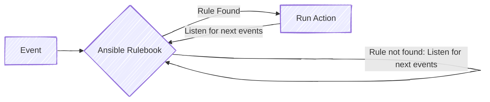

# Building a Self-Healing System using Event-Driven Ansible (EDA)

## Introduction (Why Self-Healing?)
In modern infrastructure environments, failures are inevitable. Services crash, resources get exhausted, and systems drift from their desired state. While monitoring tools can detect these issues, remediation is often still manual — leading to delayed recovery and operational overhead.

This is where self-healing systems come into play.

Instead of waiting for human intervention, a self-healing system automatically detects failures and remediates them in real time. With the introduction of Ansible Event-Driven Automation, we now have a powerful way to build such systems using familiar Ansible concepts.

In this post, I’ll walk through how to design and implement a simple Self-Healing Engine using Ansible’s event-driven model. We’ll explore the architecture, write an Ansible rulebook, trigger events, and automatically remediate system health issues using Ansible playbooks.

This guide is intended for anyone with basic Ansible knowledge who wants to move beyond traditional automation and build reactive, intelligent systems.


## What is Self-Healing in DevOps?
In DevOps, self-healing refers to the ability of a system to automatically detect failures or unhealthy conditions and remediate them without human intervention. The goal is not to prevent failures entirely, but to reduce the impact of failures and restore normal operation as quickly as possible.

In traditional setups, a typical flow looks like this:

1. A system becomes unhealthy
2. A monitoring tool raises an alert
3. An engineer investigates the issue
4. A manual fix is applied

This approach works, but it introduces delays and depends heavily on human availability. Self-healing systems aim to eliminate or minimize these manual steps by embedding remediation logic directly into the automation layer.

## Why Event-Driven Automation?

Most automation today is still reactive but not real-time. Even in well-automated environments, systems rely heavily on polling, scheduled jobs, or manual triggers to detect and fix issues.

For example:
- Cron jobs run every few minutes to check system health
- Monitoring tools raise alerts, but remediation requires manual action
- Playbooks are executed only after someone notices a problem
- 
This approach introduces delays and often results in slower recovery times, especially for issues that require immediate attention.

### Limitations of Time-Based Automation
Traditional automation models are typically time-based or request-based:
- Playbooks run on schedules (cron)
- Scripts poll metrics periodically
- Humans trigger automation after receiving alerts

While effective for certain use cases, these methods have clear drawbacks:

- Delayed response to failures
- Unnecessary resource usage due to constant polling
- Increased operational effort and alert fatigue

In dynamic systems, waiting for the next scheduled run can be too late.

### Event-Driven Automation: A Better Approach
Event-Driven Automation flips this model:

Instead of continuously checking for problems, automation is triggered only when an event occurs. An event can be anything that indicates a change in system state, such as:

- A service stopping unexpectedly
- A system metric crossing a threshold
- A log entry indicating a failure
- A webhook notification from a monitoring tool

When such an event is detected, automation reacts **immediately**, without waiting for a scheduled task or human intervention

## Introduction to Ansible Event-Driven Automation
Event-Driven Ansible is a new way of working with Ansible based on events. When a specific event occurs a corresponding action is triggered. This allows for immediate and automated response to issues or unexpected occurrences

### How does it work?
Event-Driven Ansible connects sources of events with corresponding actions via rules.

Ansible Rulebook defines the event sources and rules in the form of conditional "if-this-then-that" instructions -- the action to perform when the event occurs.

Based on the rulebook, Event-Driven Ansible recognizes the specific event, matches it with the appropriate action, and automatically executes it. Actions can optionally include executing existing ansible playbooks, templates, or modules.



## Ansible Rulebook
An Ansible Rulebook is the core building block of Ansible Event-Driven Automation (EDA).
It defines how events are received, how they are evaluated, and what actions should be taken when specific conditions are met.

Ansible Rulebook is a YAML file, Unlike traditional Ansible playbooks, which are executed manually or on a schedule, Rulebooks are continuously running and reactive. They listen for events and trigger automation immediately when conditions are satisfied.

In simple terms
> A Rulebook connects events to automation actions

### Structure of an Ansible Rulebook
An ansible rulebook is composed of three main concepts:
1. `sources`:  Where the events come from
2. `rules`: How events are evaluates
3. `actions`: What happens when a rule matches

### Rulebook Sources
> Sources define how events enter the system
They are responsible for listening to external signals and converting them into structured events that Ansible can process.

Each source runs continuously and emits events whether something happens.

Some commonly used rulebook sources include:
- **Webhook sources**: Receive HTTP events from monitoring tools
- **File or log watcher**: Detect changes in files or logs
- **System metrics sources**: Observe CPU, memory, disk usage etc.
- **Custom Sources**: Python based plugins for custom logic

A source doesn't decide what to do with an event -- it only *produces* events

Example source definition
```yaml
sources:
  - name: system_metrics
    ansible.eda.range:
      limit: 90
      unit: percent
```

### Rules in an Ansible Rulebook
> Rules define the decision logic
They evaluate incoming events and determine whether an action should be triggered.

Each rule consists of:
- A Condition (when)
- An Action (then)

Rules are evaluates continuously as events arrive

Example rule
```yaml
rules:
  - name: Restart nginx if service is down
    condition: event.service.status == "stopped"
    action:
      run_playbook:
        name: restart-nginx.yaml
```
In this rule:
- The condition checks the event payload
- If the condition evaluates to `true`, the action is triggered.

### Rulebook Actions
Actions define **what Ansible should do** when a rule matches.

The most common action is running a playbook, but action can also include:
- Logging Events
- Sending Notifications
- Triggering Workflows

Example Action

```yaml
action:
  run_playbook:
    name: remediation.yaml
```

This action executes a traditional Ansible playbook, allowing you to reuse existing automation.

This design keeps rulebooks **lightweight** and delegates heavy logic to playbooks


## Use Case - System Health Auto-Remediation

Lets consider we have a Lab environment with three VMs out of which two are running NGINX web server and one running MySQL database server.

### The manual approach with out EDA
Now imagine what happens when one of these services stops unexpectedly:
- NGINX crashes due to some configuration issues
- A process might get's killed because of resource exhaustion
- MySQL stops responding due to disk pressure or unexpected failure.

In traditional setup, the workflow looks like
1. A monitoring system detects that the service is down
2. An alert is triggered
3. An engineer receives the alert
4. The engineer logs into the server
5. The service is restarted manually

While this works, it introduces operational complexity:
- Recovery depends on human availability
- Response time may vary
- Alerts can pile up
- Manual remediation can lead to inconsistency

### The Ansible EDA approach
With Ansible EDA, we introduce a reactive layer that eliminate manual intervention for known failure scenarios

In this automation setup:
1. The services are continuously monitored
2. When a service becomes unhealthy, an event is generated
3. The rule engine evaluates the event
4. If condition match, remediation is triggered automatically

This approach:
- Reduces recovery time
- Removes repetitive manual effort
- Ensure consistent remediation
- Improves overall service availability

By combining monitoring with event-driven automation, the system becomes proactive rather than reactive.

### Event Source Configuration


### Writing the Ansible Rulebook


### Remediation Playbook


## E2E Demo Flow

## Benefits & Limitations


## Conclusion