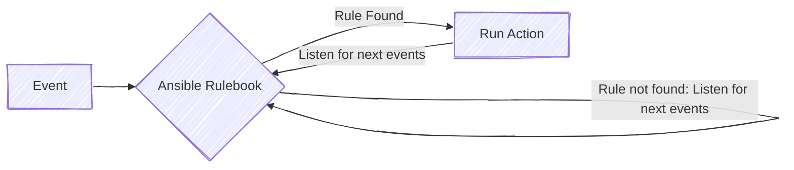

# Building a Self-Healing System using Event-Driven Ansible (EDA)

## Introduction (Why Self-Healing?)
In modern infrastructure environments, failures are inevitable. Services crash, resources get exhausted, and systems drift from their desired state. While monitoring tools can detect these issues, remediation is often still manual — leading to delayed recovery and operational overhead.

This is where self-healing systems come into play.

Instead of waiting for human intervention, a self-healing system automatically detects failures and remediates them in real time. With the introduction of Ansible Event-Driven Automation, we now have a powerful way to build such systems using familiar Ansible concepts.

In this post, I’ll walk through how to design and implement a simple Self-Healing Engine using Ansible’s event-driven model. We’ll explore the architecture, write an Ansible rulebook, trigger events, and automatically remediate system health issues using Ansible playbooks.

This guide is intended for anyone with basic Ansible knowledge who wants to move beyond traditional automation and build reactive, intelligent systems.


## What is Self-Healing in DevOps?
In DevOps, self-healing refers to the ability of a system to automatically detect failures or unhealthy conditions and remediate them without human intervention. The goal is not to prevent failures entirely, but to reduce the impact of failures and restore normal operation as quickly as possible.

In traditional setups, a typical flow looks like this:

1. A system becomes unhealthy
2. A monitoring tool raises an alert
3. An engineer investigates the issue
4. A manual fix is applied

This approach works, but it introduces delays and depends heavily on human availability. Self-healing systems aim to eliminate or minimize these manual steps by embedding remediation logic directly into the automation layer.

## Why Event-Driven Automation?

Most automation today is still reactive but not real-time. Even in well-automated environments, systems rely heavily on polling, scheduled jobs, or manual triggers to detect and fix issues.

For example:
- Cron jobs run every few minutes to check system health
- Monitoring tools raise alerts, but remediation requires manual action
- Playbooks are executed only after someone notices a problem
- 
This approach introduces delays and often results in slower recovery times, especially for issues that require immediate attention.

### Limitations of Time-Based Automation
Traditional automation models are typically time-based or request-based:
- Playbooks run on schedules (cron)
- Scripts poll metrics periodically
- Humans trigger automation after receiving alerts

While effective for certain use cases, these methods have clear drawbacks:

- Delayed response to failures
- Unnecessary resource usage due to constant polling
- Increased operational effort and alert fatigue

In dynamic systems, waiting for the next scheduled run can be too late.

### Event-Driven Automation: A Better Approach
Event-Driven Automation flips this model:

Instead of continuously checking for problems, automation is triggered only when an event occurs. An event can be anything that indicates a change in system state, such as:

- A service stopping unexpectedly
- A system metric crossing a threshold
- A log entry indicating a failure
- A webhook notification from a monitoring tool

When such an event is detected, automation reacts **immediately**, without waiting for a scheduled task or human intervention

## Introduction to Ansible Event-Driven Automation
Event-Driven Ansible is a new way of working with Ansible based on events. When a specific event occurs a corresponding action is triggered. This allows for immediate and automated response to issues or unexpected occurrences

### How does it work?
Event-Driven Ansible connects sources of events with corresponding actions via rules.

Ansible Rulebook defines the event sources and rules in the form of conditional "if-this-then-that" instructions -- the action to perform when the event occurs.

Based on the rulebook, Event-Driven Ansible recognizes the specific event, matches it with the appropriate action, and automatically executes it. Actions can optionally include executing existing ansible playbooks, templates, or modules.



## Ansible Rulebook
An Ansible Rulebook is the core building block of Ansible Event-Driven Automation (EDA).
It defines how events are received, how they are evaluated, and what actions should be taken when specific conditions are met.

Ansible Rulebook is a YAML file, Unlike traditional Ansible playbooks, which are executed manually or on a schedule, Rulebooks are continuously running and reactive. They listen for events and trigger automation immediately when conditions are satisfied.

In simple terms
> A Rulebook connects events to automation actions

### Structure of an Ansible Rulebook
An ansible rulebook is composed of three main concepts:
1. `sources`:  Where the events come from
2. `rules`: How events are evaluates
3. `actions`: What happens when a rule matches

### Rulebook Sources
> Sources define how events enter the system
They are responsible for listening to external signals and converting them into structured events that Ansible can process.

Each source runs continuously and emits events whether something happens.

Some commonly used rulebook sources include:
- **Webhook sources**: Receive HTTP events from monitoring tools
- **File or log watcher**: Detect changes in files or logs
- **System metrics sources**: Observe CPU, memory, disk usage etc.
- **Custom Sources**: Python based plugins for custom logic

A source doesn't decide what to do with an event -- it only *produces* events

Example source definition
```yaml
sources:
  - name: system_metrics
    ansible.eda.range:
      limit: 90
      unit: percent
```

### Rules in an Ansible Rulebook
> Rules define the decision logic
They evaluate incoming events and determine whether an action should be triggered.

Each rule consists of:
- A Condition (when)
- An Action (then)

Rules are evaluates continuously as events arrive

Example rule
```yaml
rules:
  - name: Restart nginx if service is down
    condition: event.service.status == "stopped"
    action:
      run_playbook:
        name: restart-nginx.yaml
```
In this rule:
- The condition checks the event payload
- If the condition evaluates to `true`, the action is triggered.

### Rulebook Actions
Actions define **what Ansible should do** when a rule matches.

The most common action is running a playbook, but action can also include:
- Logging Events
- Sending Notifications
- Triggering Workflows

Example Action

```yaml
action:
  run_playbook:
    name: remediation.yaml
```

This action executes a traditional Ansible playbook, allowing you to reuse existing automation.

This design keeps rulebooks **lightweight** and delegates heavy logic to playbooks


## Use Case - System Health Auto-Remediation

Lets consider we have a Lab environment with three VMs out of which two are running NGINX web server and one running MySQL database server.

### The manual approach with out EDA
Now imagine what happens when one of these services stops unexpectedly:
- NGINX crashes due to some configuration issues
- A process might get's killed because of resource exhaustion
- MySQL stops responding due to disk pressure or unexpected failure.

In traditional setup, the workflow looks like
1. A monitoring system detects that the service is down
2. An alert is triggered
3. An engineer receives the alert
4. The engineer logs into the server
5. The service is restarted manually

While this works, it introduces operational complexity:
- Recovery depends on human availability
- Response time may vary
- Alerts can pile up
- Manual remediation can lead to inconsistency

### The Ansible EDA approach
With Ansible EDA, we introduce a reactive layer that eliminate manual intervention for known failure scenarios

In this automation setup:
1. The services are continuously monitored
2. When a service becomes unhealthy, an event is generated
3. The rule engine evaluates the event
4. If condition match, remediation is triggered automatically

This approach:
- Reduces recovery time
- Removes repetitive manual effort
- Ensure consistent remediation
- Improves overall service availability

By combining monitoring with event-driven automation, the system becomes proactive rather than reactive.

### Event Source Configuration

Ansible provides a various kinds of  source plugins to  listen for events.
[Event Source Plugins - Ansible Docs](https://docs.ansible.com/projects/rulebook/en/v1.1.1/sources.html) 

We will use ansible EDA webhook listener to listen for events sources. 

```yaml
sources:
  - ansible.eda.webhook:
      host: 0.0.0.0
      port: 5050
```
- We will define the Event Sources under `sources` block. In the above example we are using `ansible.eda.webhook` to listen for incoming events on host `localhost` and port `5050`.
- This webhook event source allows external systems like monitoring tools, custom scripts etc to trigger rulebook actions via HTTP post

Example: Sending a event to  Ansible sources webhook 

```bash
curl -X POST http://localhost:5050 \
-H "Content-Type application/json" \
-d '{"service":"nginx", "message": "NGINX is down", "severity":"CRITICAL", "host":"ansiblevagrantlab01"}'
```

### Writing the Ansible Rulebook
Below is the sample Ansible Rulebook which listens for source events on a webhook `localhost:5050`

The rulebook contains two rules:
- The first one will check for NGINX Critical alerts and remediate them using a playbook named `restart_nginx.yaml`
- The second one will check for MySQL Critical alerts and remediate them using a playbook named `restart_mysql.yaml`


```yaml
---
- name: Ansible Rulebook Listener
  hosts: all
  sources: 
    - ansible.eda.webhook:
        host: 0.0.0.0
        port: 5050
  rules:
    - name: Remediate when NGINX is Critical
      condition: event.payload.service == "nginx" and event.payload.severity == 'CRITICAL'
      action:
        run_playbook:
          name: ./playbooks/restart_nginx.yaml
          extra_vars:
            host: "{{ event.payload.host }}"
    
    - name: Remediate when MySQL is Critical
      condition: event.payload.service == "mysql" and event.payload.severity == "CRITICAL"
      action:
        run_playbook: 
          name: ./playbooks/restart_mysql.yaml
          extra_vars:
            host: "{{ event.payload.host }}"
```
### Remediation Playbook

We have two remediation playbooks used to remediate NGINX and MySQL alerts, the logic will looks similar for both as we are just restarting the service

Playbook : `restart_nginx.yaml`
```yaml
---
- name: Playbook to restart nginx service
  hosts: "{{ host }}"
  gather_facts: false
  vars:
    service: "nginx"
  tasks:
    - name: Start of Block
      block:
        - name: Check the status of NGINX service
          ansible.builtin.service:
            name: "{{ service }}"
          register: output

        - name: Start NGINX service
          ansible.builtin.service:
            name: "{{ service }}"
            state: started
          when: output.status.ActiveState == "inactive"
      become: true
 
      rescue:
        - name: Handling Errors
          ansible.builtin.debug:
            msg: "An Error occurred while remediating the alert"


```

Playbook : `restart_mysql.yaml`
```yaml
---
- name: Playbook to restart mysql service
  hosts: "{{ host }}"
  gather_facts: false
  vars:
    service: "mysql"
  tasks:
    - name: Start of Block
      block:
        - name: Check the status of MySQL service
          ansible.builtin.service:
            name: "{{ service }}"
          register: output

        - name: Start MySQL service
          ansible.builtin.service:
            name: "{{ service }}"
            state: started
          when: output.status.ActiveState == 'inactive'
          become: true

      rescue:
        - name: Handling Errors
          ansible.builtin.debug:
            msg: "An Error occurred while remediating the alert"

```

## E2E Demo Flow

You can find all the source code used in this demo in the below git repository
[Self-Healing Git Repo](https://github.com/eswarmaganti/self-healing.git)

### Environment setup
In my previous blog post I have explained about how to setup a lab environment using vagrant. Follow the blog to setup the environment

Run the Playbook `configure_vms.yaml` to install NGINX, MySQL and configure the VMs.

```bash
ansible-playbook playbooks/configure_vms.yaml -i inventory/inventory.yaml
```

In this lab environment, we do not have a monitoring system generating alerts automatically. To demonstrate the complete workflow, we will intentionally stop the service and simulate an alert by sending a mock event to the Ansible webhook listener. This allows us to observe how Ansible detects the event and triggers remediation.


### Step 1: Run the Ansible Rulebook


Add the Ansible PrivateKey File path to Environment

```bash
$ export ANSIBLE_PRIVATE_KEY_FILE=$(pwd)/keys/vagrantkey

$ echo $ANSIBLE_PRIVATE_KEY_FILE
/Users/eswarmaganti/Developer/Projects/self-healing/keys/vagrantkey
```

Run the Ansible Rulebook

```bash
ansible-rulebook --rulebook rulebooks/rulebook.yaml -i inventory/inventory.yaml -v
2026-02-15 11:41:19,672 - ansible_rulebook.app - INFO - Starting sources
2026-02-15 11:41:19,672 - ansible_rulebook.app - INFO - Starting rules
2026-02-15 11:41:19,673 - drools.ruleset - INFO - Using jar: /opt/anaconda3/lib/python3.12/site-packages/drools/jars/drools-ansible-rulebook-integration-runtime-1.0.11-SNAPSHOT.jar
2026-02-15 11:41:20 061 [main] INFO org.drools.ansible.rulebook.integration.api.rulesengine.MemoryMonitorUtil - Memory occupation threshold set to 90%
2026-02-15 11:41:20 062 [main] INFO org.drools.ansible.rulebook.integration.api.rulesengine.MemoryMonitorUtil - Memory check event count threshold set to 64
2026-02-15 11:41:20 062 [main] INFO org.drools.ansible.rulebook.integration.api.rulesengine.MemoryMonitorUtil - Exit above memory occupation threshold set to false
2026-02-15 11:41:20 066 [main] INFO org.drools.ansible.rulebook.integration.api.rulesengine.AbstractRulesEvaluator - Start automatic pseudo clock with a tick every 100 milliseconds
2026-02-15 11:41:20,087 - ansible_rulebook.engine - INFO - load source ansible.eda.webhook
2026-02-15 11:41:20,455 - ansible_rulebook.engine - INFO - loading source filter eda.builtin.insert_meta_info
2026-02-15 11:41:20,728 - ansible_rulebook.engine - INFO - Waiting for all ruleset tasks to end
2026-02-15 11:41:20,729 - ansible_rulebook.rule_set_runner - INFO - Waiting for actions on events from Ansible Rulebook Listener
2026-02-15 11:41:20,729 - ansible_rulebook.rule_set_runner - INFO - Waiting for events, ruleset: Ansible Rulebook Listener
2026-02-15 11:41:20 730 [drools-async-evaluator-thread] INFO org.drools.ansible.rulebook.integration.api.io.RuleExecutorChannel - Async channel connected
```
From the logs we can see our rulebook is running and the source webhook waiting for incoming events

### Step 2: Stop the nginx service
Login to one of the `ansiblevagrantlab01` and stop the nginx service

```bash
$ ssh ansible@ansiblevagrantlab01 -i ./vagrantkey
Welcome to Ubuntu 22.04.5 LTS (GNU/Linux 5.15.0-160-generic aarch64)

$ systemctl status nginx
● nginx.service - A high performance web server and a reverse proxy server
     Loaded: loaded (/lib/systemd/system/nginx.service; enabled; vendor preset: enabled)
     Active: active (running) since Sun 2026-02-15 05:54:05 UTC; 13min ago
       Docs: man:nginx(8)
    Process: 6065 ExecStartPre=/usr/sbin/nginx -t -q -g daemon on; master_process on; (code=exited, status=0/SUCCE>
    Process: 6066 ExecStart=/usr/sbin/nginx -g daemon on; master_process on; (code=exited, status=0/SUCCESS)
   Main PID: 6067 (nginx)
      Tasks: 3 (limit: 4375)
     Memory: 3.2M
        CPU: 77ms
     CGroup: /system.slice/nginx.service
             ├─6067 "nginx: master process /usr/sbin/nginx -g daemon on; master_process on;"
             ├─6068 "nginx: worker process" "" "" "" "" "" "" "" "" "" "" "" "" "" "" "" "" "" "" "" "" "" "" "" ">
             └─6069 "nginx: worker process" "" "" "" "" "" "" "" "" "" "" "" "" "" "" "" "" "" "" "" "" "" "" "" ">

$ sudo systemctl stop nginx
```
### Step 3: Send alert info to WebHook endpoint 
Send a POST request with alert details to WebHook endpoint

```bash
curl -X POST http://localhost:5050 \
-H "Content-Type application/json" \
-d '{"service":"nginx", "message": "NGINX is down", "severity":"CRITICAL", "host":"ansiblevagrantlab01"}'
```

### Step 4: Ansible Rulebook received the Event

Now our rulebook received the new event with alert details and it will remediate the alert by executing the respective rule and the action defined under the rule to remediate the alert.

```bash
2026-02-15 11:41:26,375 - aiohttp.access - INFO - 127.0.0.1 [15/Feb/2026:11:41:26 +0530] "POST / HTTP/1.1" 200 151 "-" "curl/8.7.1"

PLAY [Playbook to restart nginx service] ***************************************

TASK [Check the status of NGINX service] ***************************************
ok: [ansiblevagrantlab01]

TASK [Start NGINX service] *****************************************************
changed: [ansiblevagrantlab01]

PLAY RECAP *********************************************************************
ansiblevagrantlab01        : ok=2    changed=1    unreachable=0    failed=0    skipped=0    rescued=0    ignored=0   

```

### Step 5: Validate the NGINX status in the VM
Login to the target VM and check the NGINX service status

```bash
$ systemctl status nginx
● nginx.service - A high performance web server and a reverse proxy server
     Loaded: loaded (/lib/systemd/system/nginx.service; enabled; vendor preset: enabled)
     Active: active (running) since Sun 2026-02-15 06:11:29 UTC; 16s ago
       Docs: man:nginx(8)
    Process: 6755 ExecStartPre=/usr/sbin/nginx -t -q -g daemon on; master_process on; (code=exited, status=0/SUCCE>
    Process: 6756 ExecStart=/usr/sbin/nginx -g daemon on; master_process on; (code=exited, status=0/SUCCESS)
   Main PID: 6757 (nginx)
      Tasks: 3 (limit: 4375)
     Memory: 3.2M
        CPU: 56ms
     CGroup: /system.slice/nginx.service
             ├─6757 "nginx: master process /usr/sbin/nginx -g daemon on; master_process on;"
             ├─6758 "nginx: worker process" "" "" "" "" "" "" "" "" "" "" "" "" "" "" "" "" "" "" "" "" "" "" "" ">
             └─6759 "nginx: worker process" "" "" "" "" "" "" "" "" "" "" "" "" "" "" "" "" "" "" "" "" "" "" "" ">
```

We can also mock the `mysql` alert in the same way, our rulebook can able to remediate the alert automatically.

## Deployment Options
An Ansible Rulebook must run continuously to listen for events and trigger remediation actions. Unlike traditional playbooks, rulebooks act as long-running process that waits for incoming events for configured sources such as webhooks.

There are two common approaches to deploy and operate a rulebook

### Option 1: Running as a Daemon Process
The simplest approach is to run the rulebook as a background process on a server. In this setup, the rulebook continuously listens for events and executes remediation actions when conditions are met.

This method is suitable for lab environments and small-scale deployments. The process can be managed using system services such as `systemd` to ensure it runs continuously and restarts automatically if needed.

### Option 2: Deploying as a Container on Kubernetes
For production environments, the rulebook can be containerized and deployed on a Kubernetes cluster. Kubernetes manage the lifecycle of the rulebook, ensuring High Availability and automatic restarts, and easier scalability.

This approach is useful when managing larger infrastructure or when integrating event-driven automation into cloud-native environments.


## Conclusion
Traditional automation requires humans to detect failures and trigger remediation. With Ansible Event-Driven Automation, systems can react instantly to events and recover automatically.

In this lab, we saw how service failures in NGINX and MySQL can be detected and remediated without manual intervention. Instead of waiting for alerts and human response, the system continuously listens, evaluates, and heals itself.

This is a fundamental shift from reactive operations to proactive, event-driven automation.

As infrastructure grows more complex, building self-healing capabilities becomes essential for improving reliability and reducing operational overhead. Ansible EDA provides a powerful and flexible foundation to implement these workflows using familiar Ansible concepts.

This is just the beginning — event-driven automation opens the door to building truly autonomous and resilient systems.